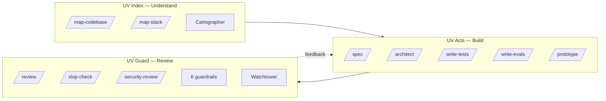
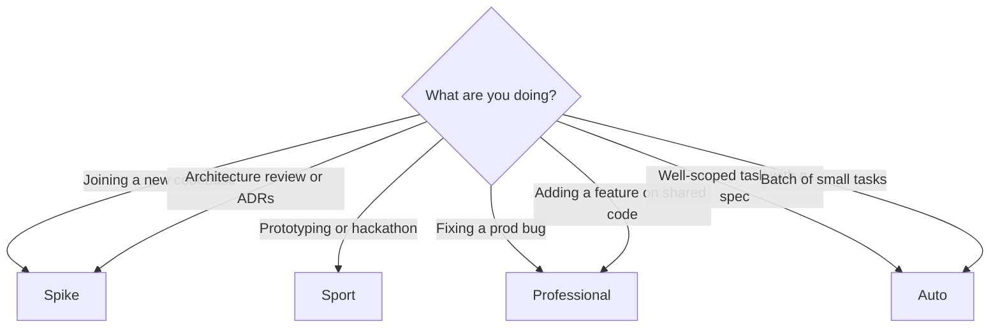

# UV Suite

> Anti-slop guardrails, specialized agents, and live observability for AI-assisted coding. Works with Claude Code, Cursor, and OpenAI Codex.

[](https://www.npmjs.com/package/uv-suite)
[](LICENSE)
[](https://github.com/utsavanand/uv-suite)

---

## Why UV Suite

AI coding agents move fast — and produce a lot of slop along the way: redundant comments, single-implementation factories, tests that assert truthiness, docs full of "robust, scalable, comprehensive."

UV Suite is the seatbelt:

- **6 anti-slop guardrails** loaded as context on every turn — stop slop before it lands
- **10 specialized agents** for Index → Acts → Guard (map, spec, build, review, secure)
- **15 slash commands** to drive the workflow
- **11 hooks** that auto-lint on save, grep for slop patterns, block destructive bash, warn on danger zones, track session duration, inject lite mode
- **Watchtower** — a zero-dep observability dashboard for everything your agent is doing
- **4 personas** to match risk tolerance: Spike (research), Sport (build), Professional (ship), Auto (autonomous)

Portable: one `uv install` drops the right format into `.claude/`, `.cursor/`, and `.codex/`.

---

## See it work

> **Concrete example.** You ask Claude to "add a payment processor." It writes a `PaymentProcessor` interface, a `PaymentProcessorFactory`, and a single `StripePaymentProcessor` implementation. The `overengineering-slop` guardrail catches it on the next turn: *"Interface with one implementation. Delete the abstraction. Call `stripe.charges.create` directly."* The agent reverts and ships ~20 lines instead of 80. Watchtower logs the catch so you can see why.

*Walkthrough video and Watchtower screenshots coming with the v1.0.0 release.*

---

## Install

```bash
npm install -g uv-suite
uv install
```

Or run without installing:

```bash
npx uv-suite install
```

Installs into your project, formatted for Claude Code, Cursor, and Codex simultaneously.

```bash
uv install                    # Install UV Suite into current project
uv claude pro                 # Start Claude Code, Professional persona
uv codex auto                 # Start Codex, Auto persona
uv pro                        # Shorthand for uv claude pro
```

---

## The mental model

UV Suite is three subsystems that map to the SDLC:



- **UV Index** — map the codebase with [Graphify](https://github.com/safishamsi/graphify) knowledge graphs, capture context, build memory.
- **UV Acts** — deliver in sequential phases (Acts) with parallel tasks, human-in-the-loop cycle budgets, spec-driven development.
- **UV Guard** — catch slop in real time, review for security ([Semgrep](https://github.com/semgrep/semgrep), [Gitleaks](https://github.com/gitleaks/gitleaks), [Trivy](https://github.com/aquasecurity/trivy)), enforce danger zones.

---

## Personas

Pick one when you start a session. Each tunes 7 knobs at once.

```
             Spike          Sport        Professional       Auto
             ─────          ─────        ────────────       ────
Purpose      Research       Build new    Ship to prod       Let it run
             & document     things

Model        Opus           Sonnet       Inherit            Inherit
Effort       max            high         high               max

Writes       Allowed        Allowed      Allowed            Allowed
             (doc-focused)
Edits        Blocked        Allowed      Allowed            Allowed

Hooks        doc-slop       lint         All                All
             watchtower     watchtower                      (autonomous)

Guardrails   Doc slop       None         All 6              All 6

Human gates  After each     End only     Every Act          Final output
             map                         boundary           only
```



**Common progressions:** Spike → Sport → Professional · Spike → Auto · Sport → Professional.

---

## Skills (15 slash commands)

| Command | What it does |
|---------|-------------|
| `/map-codebase [dir]` | Build a knowledge graph of the codebase |
| `/map-stack [dir]` | Map multiple services and their connections |
| `/spec [requirements]` | Convert requirements into a structured spec |
| `/architect [spec]` | Design architecture, decompose into Acts |
| `/write-tests [file]` | Generate tests matching project conventions |
| `/write-evals [prompt]` | Write [DeepEval](https://github.com/confident-ai/deepeval)-compatible LLM evals |
| `/prototype [concept]` | Build a static React prototype |
| `/review` | Code review: correctness, security, performance, slop |
| `/slop-check` | Detect 6 categories of AI-generated slop |
| `/security-review` | OWASP audit, dependency scan, secret detection |
| `/investigate [bug]` | Systematic root-cause debugging, escalates after 3 failed attempts |
| `/commit [message\|pr]` | Review → test → slop-check → commit (and optionally open PR) |
| `/checkpoint [label]` | Save session state — what was done, decisions, what's next |
| `/restore [label\|branch\|date]` | Restore a previous checkpoint (per-branch by default) |
| `/uv-help [topic]` | Discover skills, agents, hooks, guardrails, personas |
| `/lite [on\|off]` | Toggle terse output when tokens are tight |

---

## Hooks (fire automatically)

You don't invoke these. They sit in the harness and react to events.

| Hook | Fires on | What it does |
|------|----------|-------------|
| `auto-lint` | PostToolUse (Write\|Edit) | Runs prettier / ruff / gofmt on the touched file |
| `slop-grep` | PostToolUse (Write\|Edit) | Greps for unambiguous slop patterns (no LLM, no false positives) |
| `doc-slop-grep` | PostToolUse (Write) — Spike | Greps docs for vague adjectives ("robust", "scalable") |
| `block-destructive` | PreToolUse (Bash) | Blocks `rm -rf`, force-push to main, `DROP TABLE` |
| `danger-zone-check` | PreToolUse (Edit\|Write) | Warns when editing a file listed in `DANGER-ZONES.md` |
| `session-start` | SessionStart | Records start time |
| `session-timer` | PostToolUse (every Nth call) | Escalates at 45 / 90 / 180 min |
| `session-end` | Stop | Shows duration, today's total, reflection prompt, reminds about uncommitted changes |
| `status-line` | statusLine (continuous) | Shows session time + persona in the status bar |
| `watchtower-send` | (called by other hooks) | POSTs events to Watchtower for the live dashboard |
| `lite-mode-inject` | UserPromptSubmit | Injects terseness rules when `/lite on` or `UVS_LITE=1` is set |

---

## Watchtower — the live dashboard

Zero-dep Node server (`watchtower/server.js`) + dashboard (`watchtower/dashboard.html`). Every hook event — file writes, slop catches, session boundaries, blocked bash — streams in over Server-Sent Events. You see what your agent is doing as it does it.

```bash
node watchtower/server.js          # http://localhost:4200
```

Filter by session, event type, or "needs human." Multiple sessions in different terminals show up side-by-side. If you start it twice on the same port it detects the running instance and exits cleanly instead of crashing.

---

## Guardrails (6 anti-slop rules)

Loaded as context on every Professional/Auto turn. They describe the slop pattern, give before/after examples, and tell the agent how to fix it.

| Guardrail | Catches |
|-----------|---------|
| `comment-slop` | Comments that restate what the code already says |
| `overengineering-slop` | Single-impl interfaces, factories of one, premature abstraction |
| `architecture-slop` | Microservices for 100 users, GraphQL for 5 fixed queries |
| `test-slop` | `toBeTruthy()`, mocking the thing you're testing, snapshots on trivial UI |
| `doc-slop` | "Robust", "scalable", "leverages industry-standard best practices" |
| `error-handling-slop` | Try/catch around code that can't throw; catch-log-rethrow |

---

## Agents (10, each in 4 formats)

| Agent | Subsystem | Model | Cycle Budget |
|-------|-----------|-------|-------------|
| Cartographer | UV Index | Opus | 1 |
| Spec Writer | UV Acts | Opus | 1 |
| Architect | UV Acts | Opus | 2 |
| Reviewer | UV Guard | Opus | 1 |
| Test Writer | UV Acts | Sonnet | 3 |
| Eval Writer | UV Acts | Opus | 2 |
| Anti-Slop Guard | UV Guard | Opus | 1 |
| Prototype Builder | UV Acts | Sonnet | 3 |
| DevOps | UV Acts | Opus | 2 |
| Security | UV Guard | Opus | 1 |

Each agent ships in `agents/claude-code/`, `agents/cursor/`, and `agents/codex/`. The installer picks the right format for your harness.

---

## Artifacts

Agents write persistent output to `uv-out/`. Each agent reads prior artifacts automatically.

| Output | Read by |
|--------|---------|
| `uv-out/map-codebase.md` | `/architect`, `/review`, `/security-review` |
| `uv-out/specs/*.md` | `/architect`, `/write-tests`, `/write-evals` |
| `uv-out/architecture/*.md` | `/review`, `/write-tests`, `/slop-check` |
| `uv-out/review-*.md` | `/slop-check`, `/security-review` |
| `uv-out/checkpoints/*.md` | `/restore` |

---

## Integrations

| Tool | Used by | Purpose |
|------|---------|---------|
| [Graphify](https://github.com/safishamsi/graphify) | Cartographer | Knowledge graph from codebase via Tree-sitter |
| [Semgrep](https://github.com/semgrep/semgrep) | Security Agent | SAST with 4000+ OWASP-mapped rules |
| [Gitleaks](https://github.com/gitleaks/gitleaks) | Security Agent | Secret detection in git repos |
| [Trivy](https://github.com/aquasecurity/trivy) | Security Agent | Dependency vulnerability scanning |
| [DeepEval](https://github.com/confident-ai/deepeval) | Eval Writer | Pytest-compatible LLM evaluation |
| [Playwright](https://playwright.dev/docs/getting-started-mcp) | Prototype Builder, Test Writer | Browser automation and e2e testing |

---

## Project structure after install

```
.claude/
  settings.json        Permissions, hooks (from persona)
  agents/              10 agent definitions
  skills/              16 slash commands
  hooks/               11 hook scripts
  rules/               6 anti-slop guardrails
  personas/            4 persona configs
.codex/agents/         10 Codex agent definitions
.cursor/rules/         10 Cursor rule definitions
AGENTS.md              Codex instruction file
DANGER-ZONES.md        Risky areas (commit this)
uv-out/                Agent output artifacts (gitignored)
watchtower/            Optional live dashboard
```

---

## Documentation

| Document | What it covers |
|----------|---------------|
| [usage-guide.md](usage-guide.md) | Full SDLC mapped to exact commands |
| [personas.md](personas.md) | 4 personas, 7 knobs, when to use each |
| [practices.md](practices.md) | Working principles (honesty, parallelism, scope, completion) |
| [acts-methodology.md](acts-methodology.md) | Acts delivery framework with worked examples |
| [methodology/human-in-the-loop.md](methodology/human-in-the-loop.md) | Cycle budgets, intervention types, learning loops |
| [collaboration/sharing-and-standards.md](collaboration/sharing-and-standards.md) | Danger zones, team standards, sharing levels |
| [landscape.md](landscape.md) | Open source tools and references for each agent |

---

## Contributing

PRs welcome. See [CONTRIBUTING.md](CONTRIBUTING.md) and [CODE_OF_CONDUCT.md](CODE_OF_CONDUCT.md).

## License

MIT
